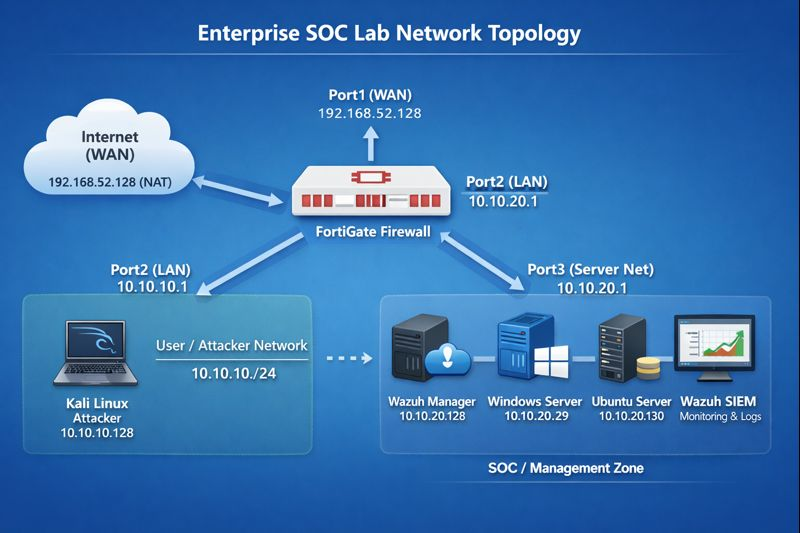
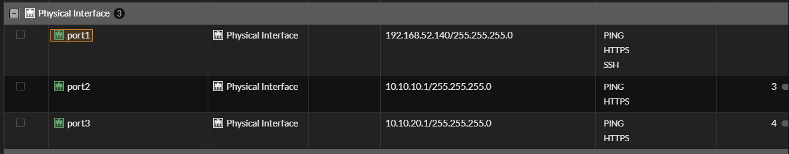
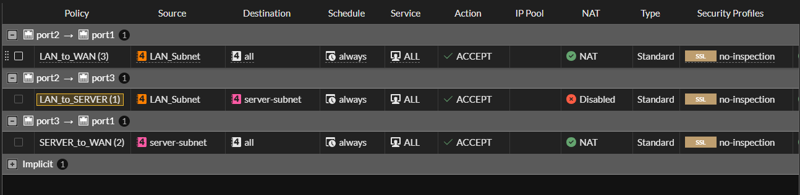
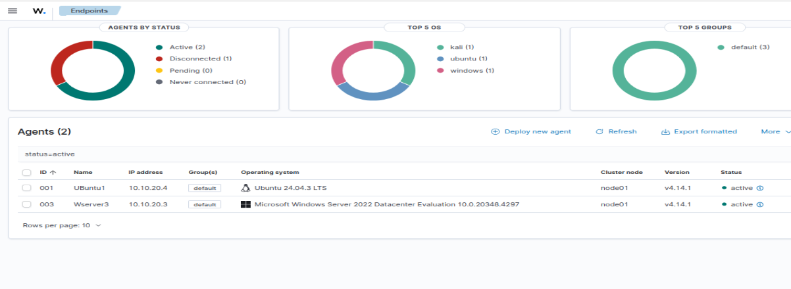
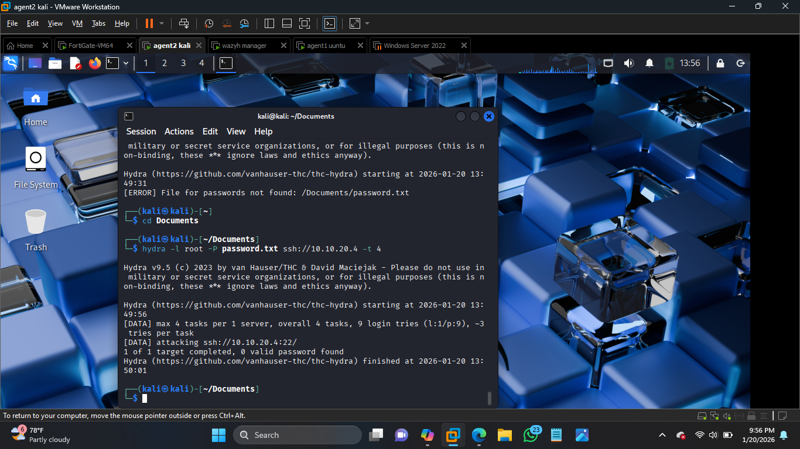
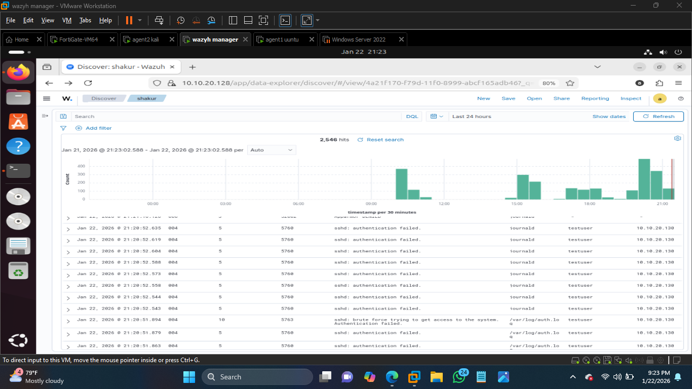
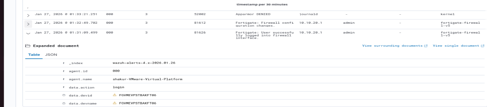

> **Enterprise SOC & Network Security Lab (FortiGate + Wazuh)**


# Enterprise SOC & Network Security Lab

**FortiGate • Wazuh • Active Directory (Planned) • Attack Simulation**

## 📌 Project Overview

This project documents the design, implementation, and troubleshooting of a simulated **enterprise cybersecurity lab environment**.
The lab is built for hands-on learning in:

* Network Security
* SOC Operations
* Firewall Configuration
* SIEM (Wazuh)
* Logging & Detection
* Blue Team Practices

The environment is hosted using **VMware Workstation** and simulates real-world enterprise segmentation.

---

## 🎯 Objectives

This lab helps practice:

* Building segmented enterprise networks
* Deploying and configuring FortiGate firewall
* Configuring routing, NAT, and firewall policies
* Deploying Wazuh SIEM and agents
* Troubleshooting connectivity and logging issues
* Understanding trust zones and attack surfaces
* Practicing SOC monitoring concepts

---

## 🧱 Lab Architecture

### Network Zones

| Zone    | Purpose                               | Trust Level |
| ------- | ------------------------------------- | ----------- |
| WAN     | Internet (VMware NAT)                 | Untrusted   |
| LAN     | User / Attacker network               | Medium      |
| Servers | Critical systems (Wazuh, AD, servers) | High        |
## Network Topology



---

## 💻 Environment

| Component       | OS / Device    | Role                    | IP Address          |
| --------------- | -------------- | ----------------------- | ------------------- |
| FortiGate VM    | FortiOS        | Firewall / Gateway      | WAN: 192.168.52.128 |
| FortiGate Port2 | Interface      | LAN / Attacker Network  | 10.10.10.1          |
| FortiGate Port3 | Interface      | Servers Network         | 10.10.20.1          |
| SOC Manager     | Ubuntu         | Wazuh Manager           | 10.10.20.128        |
| Ubuntu Server   | Ubuntu         | Monitored Server        | 10.10.20.130        |
| Windows Server  | Windows Server | Monitored Server        | 10.10.20.29         |
| Kali Linux      | Kali           | Attacker / Test Machine | 10.10.10.128        |

> Internal machines access the internet through FortiGate using NAT.

---

## 🔥 FortiGate Configuration

### Interfaces

* Port1 → WAN (VMware NAT)
* Port2 → LAN (Kali attacker network)
* Port3 → Servers network (Wazuh, Windows, Ubuntu)

### Firewall Policies

| Policy        | Source → Destination | NAT      | Logging      |
| ------------- | -------------------- | -------- | ------------ |
| LAN → WAN     | Port2 → Port1        | Enabled  | All Sessions |
| LAN → Servers | Port2 → Port3        | Disabled | All Sessions |
| Servers → WAN | Port3 → Port1        | Enabled  | All Sessions |

> Logging is critical. Without `logtraffic all`, Wazuh will not receive logs.

CLI example:

```
config firewall policy
    edit <policy_id>
        set logtraffic all
    next
end
```

---

## 📊 Wazuh Deployment

* Wazuh Manager installed on Ubuntu
* Wazuh Dashboard accessible via browser
* Agents installed on:

  * Windows Server
  * Ubuntu Server

Agents successfully appear as **Active** in dashboard.


---

## 🔄 Agent Troubleshooting Performed

After network changes, agents disconnected. Fix applied:

* Updated manager IP in agent config:

  * Linux: `/var/ossec/etc/ossec.conf`
  * Windows: `C:\Program Files (x86)\ossec-agent\ossec.conf`
* Removed old agents using `manage_agents`
* Deleted `client.keys`
* Restarted agent services

✅ Agents reconnected successfully


---

📊Attack Simulation: Brute-Force from Kali

To verify the SOC environment, a controlled brute-force attack was performed from the Kali Linux attacker machine (10.10.10.128):

Targeted the Ubuntu server via SSH

Generated failed login attempts using Hydra / manual password guessing

Observed Wazuh detect and log the events in real-time on the dashboard






Wazuh correctly identified the failed authentication attempts

Alerts include:

Source IP (Kali)

Destination IP (Ubuntu server)

Action (Failed SSH login)

Policy / rule triggered (sshd: authentication failed)

This proves that the FortiGate firewall + Wazuh SIEM integration is functional and capable of detecting security events within the simulated enterprise network.
## 📡 FortiGate → Wazuh Syslog Integration

Correct configuration is critical:

* Use **FortiGate IP from same network as Wazuh**
* Do NOT use WAN IP

Correct config used:

```
<allowed-ips>10.10.20.1</allowed-ips>
```

FortiGate CLI:

```
config log syslogd setting
    set status enable
    set server 10.10.20.128
    set port 514
    set source-ip 10.10.20.1
end
```

---

## ✅ Validation Steps

Generate traffic:

```
ping 8.8.8.8
```

Check logs on Wazuh:

```
tail -f /var/ossec/logs/alerts/alerts.log
```

Verify:

* Source IP
* Destination IP
* Action (Accept/Deny)
* Policy name

---

## ⚠️ Common Issues Solved

| Issue                     | Cause              | Fix                     |
| ------------------------- | ------------------ | ----------------------- |
| No internet               | Missing gateway    | Set correct gateway     |
| Ping works, browser fails | DNS issue          | Fix DNS                 |
| Agents disappeared        | Old IP configs     | Re-register agents      |
| No logs in Wazuh          | Logging disabled   | Enable `logtraffic all` |
| Logs not received         | Wrong FortiGate IP | Use Port3 IP            |

---

## 📌 Limitations (FortiGate VM Free)

* Max 3 interfaces
* Max 3 firewall policies
* Limited features

Lab design was adapted to work within these limits.

---

## 📍 Current Status

✔ FortiGate routing functional
✔ NAT and internet working
✔ Wazuh Manager operational
✔ Agents connected
✔ Logging functional
✔ Attack simulation in progress

---

## 🚧 Next Phase (Planned Improvements)

* Active Directory deployment
* Windows domain logging
* FortiGate advanced logging
* Custom Wazuh rules
* Detection engineering exercises

---

## 👤 Author

**Shakur**
Telecommunications Engineer | SOC & Network Security Enthusiast

---
